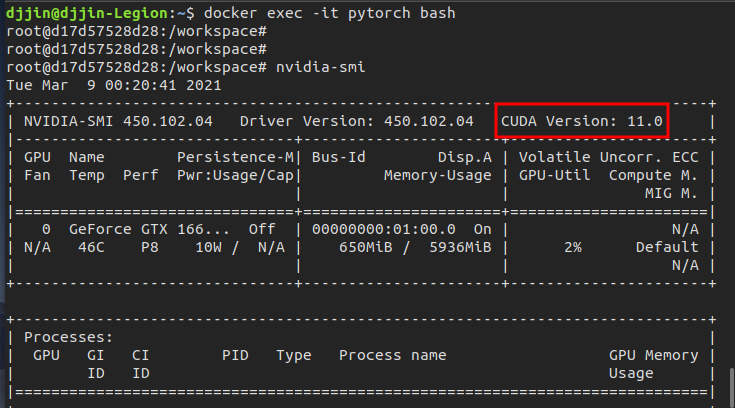
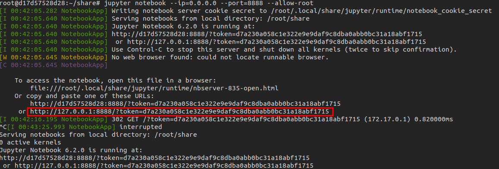

# Docker 설치 및 실행 방법

[](LICENSE)[](https://github.com/jdj2261)

Docker 설치 및 실행 (참고 : [도커설치방법](https://blog.cosmosfarm.com/archives/248/%EC%9A%B0%EB%B6%84%ED%88%AC-18-04-%EB%8F%84%EC%BB%A4-docker-%EC%84%A4%EC%B9%98-%EB%B0%A9%EB%B2%95/), [도커 사용법](https://0902.tistory.com/4))

작성자 : 진대종 ([github](https://github.com/jdj2261))

> Environment
>
> - Ubuntu Version : 18.04
> - CUDA Version : 10.0
> - cuDNN Version :  7.6.5

**Docker를 설치하려는 이유?**

- 프로그램 의존성이 가져다주는 스트레스를 해소시키기 위해 개발된 프로그램.

*Docker 컨테이너는 단지 명령만 실행하고 그 결과만 보여주는 기능을  수행한다.*

### 1. Docker 설치

~~~
$ sudo apt update
$ sudo apt install apt-transport-https ca-certificates curl software-properties-common
$ curl -fsSL https://download.docker.com/linux/ubuntu/gpg | sudo apt-key add -
$ sudo add-apt-repository "deb [arch=amd64] https://download.docker.com/linux/ubuntu bionic stable"
$ sudo apt update

# 도커가 설치 되었는지 확인
$ apt-cache policy docker-ce

# Installed : none
$ sudo apt -y install docker-ce
~~~

---

### 2. Docker 실행

#### 2-1. Docker 정상 실행 확인

~~~
$ sudo systemctl status docker
~~~

- docker 설치 후 /var/run/docker.sock의 permission denied 발생하는 경우

  ~~~
  $ sudo chmod 666 /var/run/docker.sock
  ~~~

- docker 명령어 권한 변경하기

  ~~~
  $ sudo usermod -aG docker $USER
  ~~~

####  2-2. Docker 이미지 확인

- 도커 엔진에 존재하는 이미지 목록 확인

  ~~~
  $ docker images
  ~~~

#### 2-3. Docker 이미지 다운

- 도커 허브에서 이미지를 받아옴

- centos, ubuntu 등은 바로 받아올 수 있음.

  ~~~
  $ docker pull centos
  ~~~

#### 2-4. Docker 이미지 삭제

- 이미지 삭제

  ~~~
  $ docker rmi (이미지id)
  ~~~

- 컨테이너 삭제하기 전에 이미지 삭제

  ~~~
  $ docker rmi -f (이미지id)
  ~~~

#### 2-5. Docker 이미지로 컨테이너 생성

- 다운로드한 이미지로 컨테이너를 생성한다.

  > - -i는 상호 입출력
  > - t는 tty를 활성화하여 bash 쉘을 사용

  ~~~
  $ docker create -i -t --name (설정하려는 컨테이너 이름) (이미지 이름)
  $ docker create -i -t --name mycontainer centos
  ~~~

  > $ docker ps -a 
  >
  > 위 명령어를 사용하면  STATUS가 "Created" 상태로 나옴.

#### 2-6. 생성된 컨테이너 실행

- 생성한 컨테이너 시작후 사용

  ~~~
  $ docker start mycontainer
  ~~~

  > $ docker ps -a
  >
  > 위 명령어를 사용하면 STATUS가 "Up" 상태로 나옴.

#### 2-7. 생성된 컨테이너 실행

- 컨테이너가 Up 상태일 경우 attach 명령어를 사용해서 접속 가능

  ~~~
  $ docker attach mycontainer
  ~~~

- 컨테이너가 정상적으로 실행되면 쉘이 변경됨

  ~~~sh
  [root@233506~~~ / ] #
  ~~~

#### 2-8. 이미지로 컨테이너 생성 및 실행

- docker run 명령어는 docker create + docker start + docker attach를 한번에 실행하는 것과 같음

- docker run 명령어를 사용하면 이미지를 실행하여 docker container를 실행

- 이미지가 없을 경우 도커 허브에서 최신 이미지를 자동으로 pull

  ~~~
  $ docker run -i -t centos
  ~~~

---

### 3. 컨테이너 확인

#### 3-1. 컨테이너 목록 확인

- docker ps 명령어는 정지되지 않은 컨테이너 목록만 출력

- docker ps -a 명령어는 정지된 컨테이너 목록까지 포함한 모든 컨테이너 출력

  ~~~
  $ docker ps
  $ docker ps -a
  ~~~

#### 3-2. 컨테이너 이름 변경

- --name 옵션으로 컨테이너 이름을 설정하지 않았다면 도커 데몬에 의해 랜덤하게 이름이 설정됨

- 이런 경우나, 다른 이름으로 변경하려면 rename 명령어를 사용하면 됨.

  ~~~
  $ docker rename (기존 컨테이너 이름) (변경할 컨테이너 이름)
  ~~~

#### 3-3. 컨테이너 중지

- 컨테이너가 실행중이면 Host 자원을 사용하므로 사용하지 않을 때 중지할 수 있음.

- docker rm과는 다르게 stop을 한 후 다시 start 하면 전에 했던 작업 이어서 가능

  ~~~
  $ docker stop (중지할 컨테이너 이름)
  ~~~

#### 3-4. 컨테이너 삭제

- 컨테이너 삭제 시 컨테이너 실행 및 작업한 모든 내용이 삭제되므로 주의해야함.

- 삭제를 원한다면 rm 명령어 사용

  ~~~
  $ docker rm (삭제할 컨테이너 이름)
  ~~~

- 단, 실행중(Up 상태)인 컨테이너는 삭제할 수 없으므로 -f 옵션 필요

  ~~~
  $ docker rm -f (삭제할 컨테이너 이름)
  ~~~

- docker stop으로 중지 시킨 후, rm으로 삭제할 수 있음.

  ~~~
  $ docker stop (삭제할 컨테이너 이름) \ docker rm (삭제할 컨테이너 이름)
  ~~~

#### 3-5. 모든 컨테이너 삭제

- 존재하는 모든 컨테이너 삭제를 위해 사용

  ~~~
  $ docker contianer prune
  ~~~

  or

  ~~~
  $ docker stop $(docker ps -a -q) \ docker rm $(docker ps -a -q)
  ~~~

---

### 4. Docker 명령어 확인

- docker, docker-h, docker --help 등의 명령어 입력하여 사용법, 옵션 확인 가능
- docker (명령어) --help, h

---

### 5. Nvidia-docker 설치

```
# Add the package repositories
$ distribution=$(. /etc/os-release;echo $ID$VERSION_ID)
$ curl -s -L https://nvidia.github.io/nvidia-docker/gpgkey | sudo apt-key add -
$ curl -s -L https://nvidia.github.io/nvidia-docker/$distribution/nvidia-docker.list | sudo tee /etc/apt/sources.list.d/nvidia-docker.list
$ sudo apt-get update & sudo apt-get install -y nvidia-container-toolkit
$ sudo systemctl restart docker
```

### 6. Docker 파일 복사

#### 6-1. Host -> Container

- docker cp [host 파일경로]  [container name]:[container 내부 경로]

~~~
$ sudo docker cp yolov3_pytorch:/usr/src/app/runs/detect/exp /home/djjin/share
~~~


# Pytorch 컨테이너 만들기

### 1. docker에서 Pytorch 이미지 찾기

- pytorch와 관련된 이미지가 어떤 것들이 있는지 알 수 있음.

~~~
$ docker search pytorch
~~~

### 2. Pytorch 이미지 다운로드

~~~
$ docker pull pytorch/pytorch
~~~

### 3. 이미지 확인

~~~
$ docker images
~~~

### 4. nvidia-docker와 연동하여 pytorch 컨테이너 만들기

~~~
$ docker run -itd --name pytorch -v /home/djjin/share:/root/share -p 8888:8888 --gpus all --restart=always pytorch/pytorch
~~~

> - -v : 내가 만든 share 폴더에 있는 파일들을 pytorch 컨테이너의 share 폴더와 공유
> - -p : local host의 8888포트와 pytorch 컨테이너의 8888포트를 연결해준다
> - --restart=alwayas : 매번 docker start 명령어 입력하는게 번거로우니 이 옵션을 추가한다.

~~~
$ nvidia-docker run -it --device=/dev/video0 -v /tmp/.X11-unix:/tmp/.X11-unix -e DISPLAY=$DISPLAY -e QT_X11_NO_MITSHM=1 --ipc=host --gpus all ultralytics/yolov3:v8.0_archive
~~~

### 5. Pytorch 컨테이너 실행하기

> ~~~
> $ docker exec -it pytorch bash
> ~~~
>

### 6. GPU 동작 확인하기

~~~dockerfile
# nvidia-smi
~~~



### 7. Pytorch 동작 확인하기

~~~python
# python
import torch
torch.cuda.is_available()
x = torch.rand(5,3)
print(x)
~~~


### 8. 추가 패키지 설치하기

~~~dockerfile
# conda install jupyter
~~~

### 9. jupyter notebook 실행하기

~~~
# cd share
# jupyter notebook --ip=0.0.0.0 --port=8888 --allow-root
~~~



> 웹 브라우져에 위의 주소를 복사하면 jupyter notebook이 실행됨.

---

# Docker 이미지 배포하기

내가 만든 컨테이너를 이미지로 만들어주어 docker hub에 배포하면 됨.

(gpu를 사용하는 프로그램이면 nvidia docker는 꼭 설치되어야 한다!)

### 1. 현재 실행중인 컨테이너 확인

~~~
$ docker ps -a
~~~

### 2. 배포할 컨테이너 중단하기

~~~
$ docker stop pytorch
~~~

### 3. 배포할 컨테이너를 이미지 파일로 만들기

> docker commit $(배포할 컨테이너 이름) $(이미지 파일 이름:버전)

~~~
$ docker commit pytorch pytorch_distribution_test:1
~~~


### 4. docker hub 로그인

~~~
$ docker login
아이디, 패스워드 입력
~~~

### 5. 배포하기

> docker push 도커허브아이디/배포할이미지파일:버전

~~~
$ docker push djjin/pytorch_distribution_test:1
~~~

이때 **An image does not exist locally with the tag: djjin/pytorch_distribution_test** 에러가 뜰 것이다.

docker hub의 repository 이름과 로컬 도커 이미지 REPOSITROY 이름을 똑같이 해줘야 한다.

~~~
$ docker image tag pytorch_distribution_test:1 djjin/pytorch_distribution_test:1
~~~

이미지를 복사하여 새로운 이미지를 만들어 내면 된다.

다시 push 하면 정상적으로 동작이 되는 것을 확인할 수 있다.

### 6. 배포 확인하기

- docker hub에 접속하여 repositories로 들어간다


- 터미널을 통해 이미지 당겨오기

  ~~~
  $ docker pull djjin/pytorch_distributuion_test:1
  ~~~


# VScode와 Docker 연동하기 

### 1. 필요 기능 추가하기

---

#### 1-1. remote development 설치

- VScode IDE와 local host의 docker 컨테이너를 연동시키기 위함


#### 1-2. docker 설치

- docker를 검색하여 'Docker', 'Docker Engine'을 설치한다.

  terminal을 따로 실행시키지 않고 Vscode에서 GUI 형태로 contianer를 손쉽게 on/off 해주기 위함.


- 설치가 마무리되면 아래와 같이 plug-in 된 프로그램 아이콘이 생성된다.

  

### 2. 연동하기

- 'ctrl + shift + p' 를 누르고  'remote-containers: attach to Running Container...'를 입력 후 클릭한다.

- 현재 실행되고 있는 container 목록이 뜨며 원하는 container를 클릭한다.

- 새로운 window 창을 통해 VScode IDE가 생성되며 "File->Open folder"를 클릭한다.

- Docker에서 생성해주었던 container 디렉토리를 찾아 'OK' 버튼을 눌러주면

  연동되는 것을 확인할 수 있으며 test.py를 만들어 테스트 해본다.

- 생성된 Vscode 편집기에서 터미널을 열어 'apt-get update', 'apt-get install locales' 명령어를 입력한다.

- 그 후, dpkg-reconfigure locales 명령어를 입력하여 계속 엔터를 누르다가

  158

  3

  번호를 순차적으로 입력한다.

- "Extension" 에서 Python을 설치하면 jupyter notebook을 이용할 수 있다.